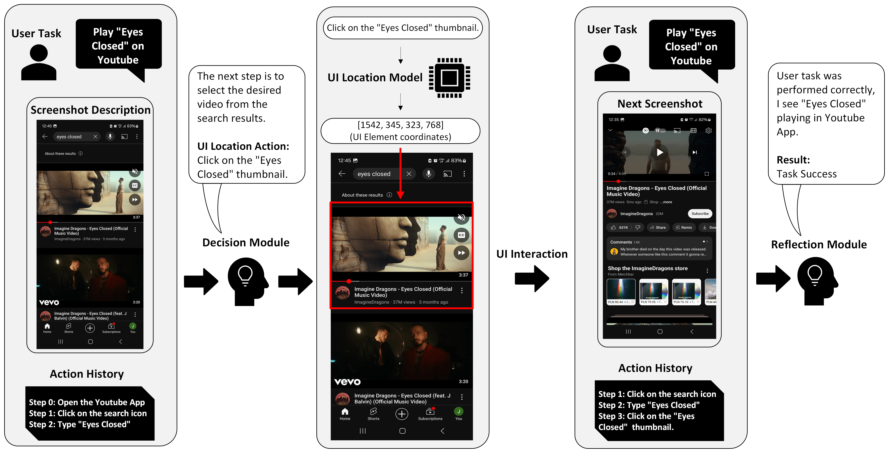

<p align="center">
  
</p>

<div align="center">
<h3>Enhancing UI Location Capabilities of Autonomous Agents</h3>
</div>
  
<div align="center">
<hr>
</div>

  

## 📺 Demo
https://github.com/user-attachments/assets/356ee6b2-86bb-417a-b24c-bbd206aafe2a

## ☀️ Introduction

With the growing reliance on digital devices equipped with graphical user interfaces (GUIs), such as computers and smartphones, the need for effective automation tools has become increasingly important. Although multimodal large language models (MLLMs) like GPT-4V excel at tasks such as drafting emails, they struggle with GUI interactions, which limits their effectiveness in automating everyday tasks. In this paper, we introduce ClickAgent, a novel framework for building autonomous agents. In ClickAgent, the MLLM handles reasoning and action planning, while a separate UI location model (e.g., SeeClick) identifies the relevant UI elements on the screen. This approach addresses a key limitation of current-generation MLLMs: their difficulty in accurately locating UI elements.

ClickAgent significantly outperforms other prompt-based autonomous agents (such as CogAgent, AppAgent, and Auto-UI) on the AITW benchmark. Our evaluation was conducted on both an Android smartphone emulator and an actual Android smartphone, using the task success rate as the key metric for measuring agent performance.


## 🚀 Getting Started

### 🔧 Installation
```bash
pip install -r requirements.txt
```

### 🤖 Android Environment Setup

1. Download the [Android Debug Bridge](https://developer.android.com/tools/releases/platform-tools?hl=en).
2. Turn on the ADB debugging switch on your Android phone, it needs to be turned on in the developer options first.If it is the HyperOS system, you need to turn on USB Debugging (Security Settings) at the same time.
3. Connect your phone to the computer with a data cable and select "Transfer files".
4. Test your ADB environment as follow: `/path/to/adb devices`. If the connected devices are displayed, the preparation is complete.
5. If you are using a MAC or Linux system, make sure to turn on adb permissions as follow: `sudo chmod +x /path/to/adb`
6. If you are using Windows system, the path will be `xx\xx\adb.exe`

In case you need additional information about ADB, you can find it here: [ADB Docs](https://developer.android.com/tools/adb)
  
#### 📋 Used apps

<details>
  <summary>Show list</summary>

    1. Clock
    2. Calendar
    3. Files
    4. Messages
    5. Contacts
    6. Calculator
    7. Settings
    8. Gmail
    9. Google Chrome
    10. Google Maps
    11. Google Play
    12. Google Movies
    13. Google Photos
    14. YouTube 
    15. YouTube Music
    16. Netflix
    17. Spotify
    18. Amazon Alexa
    19. Amazon Music
    20. Amazon Prime
    21. X (Twitter)
    22. Facebook
    23. Instagram
    24. Pandora
    25. Yahoo
    26. Yelp
    27. eBay
    28. Wikipedia

</details>

#### 📱 Emulator

1. Download and install [Android Studio](https://developer.android.com/studio)
2. Tools -> Device Manager
3. Create Virtual Device
4. Information about device, such as AVD ID and snapshot names you can find in details of created emulator

### ⚙️ Configuration

All configurations are stored in `config.ini`. Every parameter can be overridden as a command line argument. 

List of arguments:
```commandline
run.py 
--config-path path to configuration file

--instruction instuction
--action-file folder name in eval-save-folder where output will be saved

--qwen IP:PORT Add port to host_api_worker.py default 21002
--internvl IP:PORT
--florence IP:PORT

--use-eval True/False use reflection module
--use-florence-only True/False use only UI Location Module

--do-stop add to prompt STOP action
--option "1/2" decision prompt choice

--adb-path path to adb
--aapt-path path to aapt
--emu-path path ot emulator
--device-type real or emu
--device-id id of device
--avd-name name of emulator AVD
--snapshot run specified snapshot
--run-apps-through-adb run applications directly with app id using adb if present

--max-steps max number of steps per instruction 
--eval-save-folder folder name where output will be saved
```

### 🔬 Run Experiments

After modifying the config to what you like, you can now run experiments with the following commands:

```shell
cd tests
python run_test.py
```

### 📐 Main Results Reproduction

To reproduce the results shown in Table 1 of our paper, you must first host TinyClick, server and InternVL ([vLLM](https://docs.vllm.ai/en/latest/index.html) is recommended).

After this use default values of [`config.ini`](config.ini).


#### TinyClick server
```shell
cd api
python host_florence.py
```

#### Host server
```shell
cd api
python host_api_worker.py
```

#### InternVL2-Llama3-76B server 
```shell
pip install vllm
vllm serve OpenGVLab/InternVL2-Llama3-76B --served-model-name internlm2 --tensor-parallel-size 4 
```

### 🏃 Run
```shell
python run.py
```

## 📖 Citation
```bib
@misc{hoscilowicz2024enhancinguilocationcapabilities,
      title={Enhancing UI Location Capabilities of Autonomous Agents},
      author={Jakub Hoscilowicz and Bartosz Maj and Bartosz Kozakiewicz and Oleksii Tymoschuk and Artur Janicki},
      year={2024},
      eprint={2410.11872},
      archivePrefix={arXiv},
      primaryClass={cs.HC},
      url={https://arxiv.org/abs/2410.11872},
}
```
